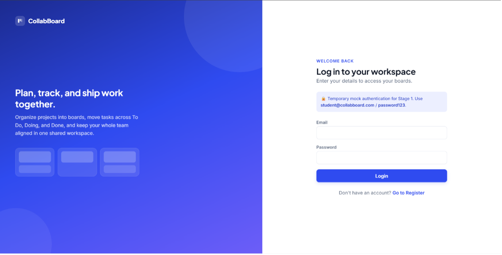
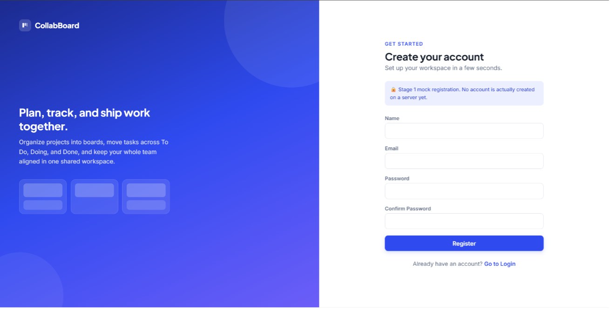
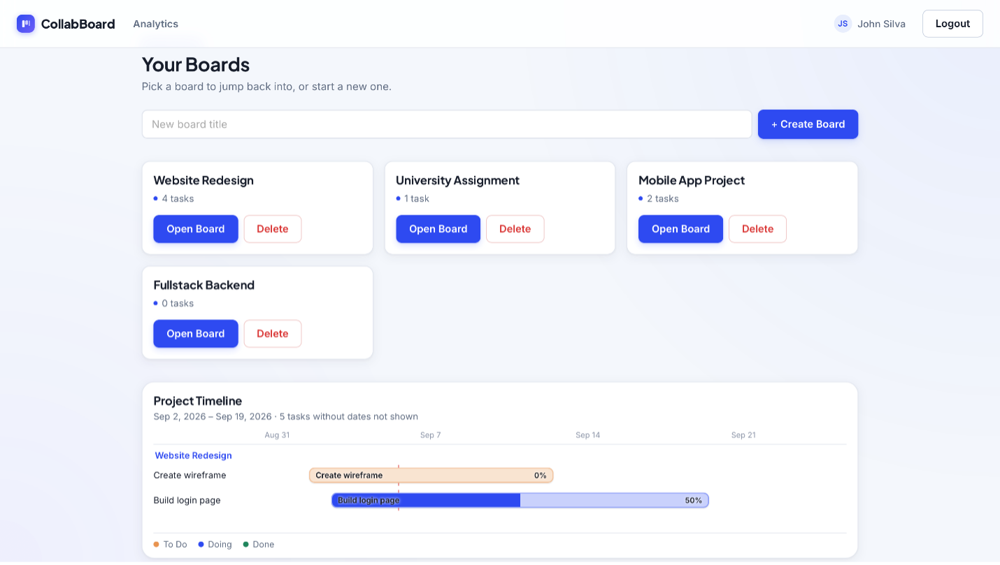
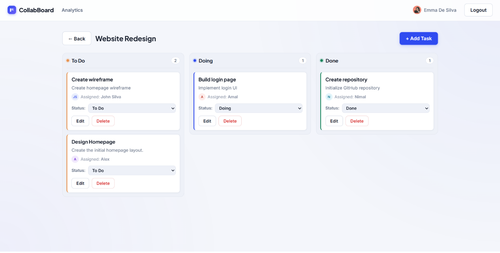
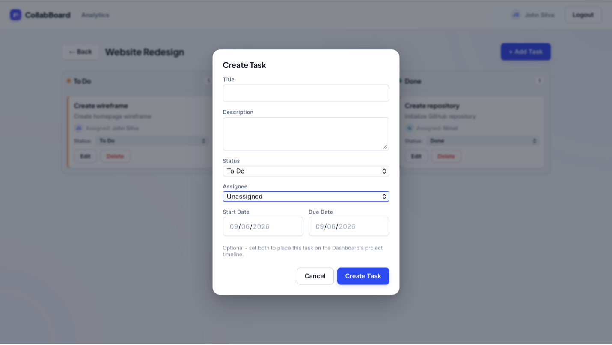
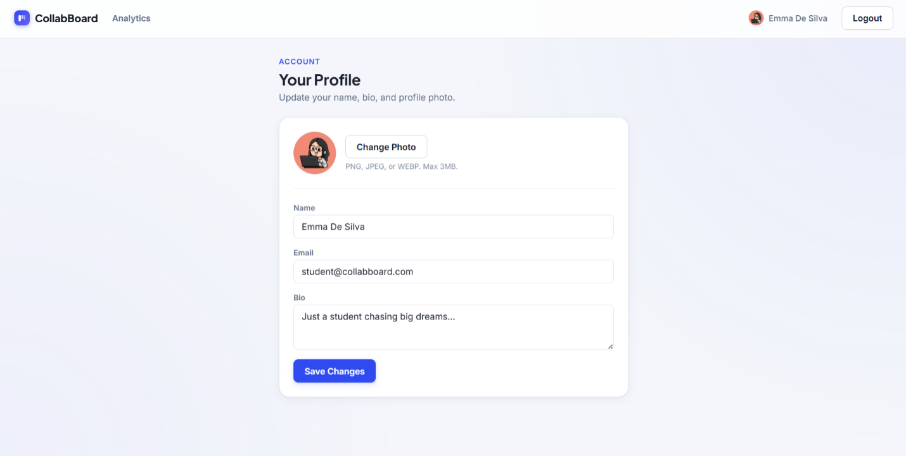
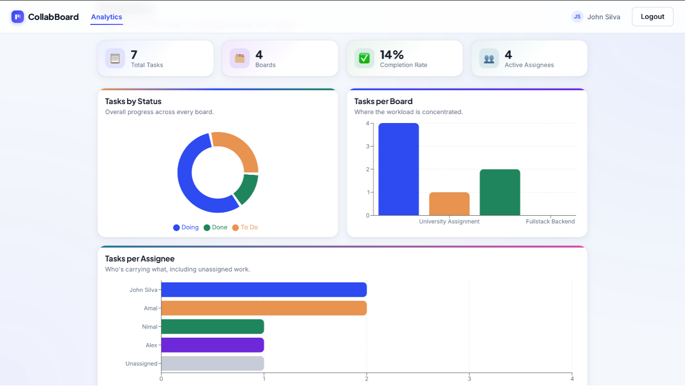

# 🚀 CollabBoard

<p align="center">
  
</p>

<p align="center">
  <strong>A collaborative Kanban-style task management application for organizing projects, boards, and tasks.</strong>
</p>

<p align="center">
  <a href="https://github.com/AdithyaHerath/project-fullstack">
    
  </a>
  
  
</p>

---

## 📌 About the Project

**CollabBoard (SyncBoard)** is a collaborative Kanban-style task management application designed to help teams organize projects, manage boards, and track tasks through different stages of development.

The application provides a complete full-stack implementation consisting of:

- React frontend
- Node.js and Express.js REST API backend
- MongoDB Atlas database
- Mongoose for database interaction
- JWT-based authentication
- Board management
- Task management
- User profile management
- Analytics dashboard
- Postman API testing and documentation

This project was developed as part of **Assignment 03 – REST API Backend Development, Frontend Integration, and Database Implementation** for the **Full Stack Development (PUSL3120)** module.

---

# ✨ Features

## 🔐 Authentication

- User registration
- User login
- JWT-based authentication
- Protected API endpoints
- User profile retrieval
- User profile management
- Secure authentication flow

---

## 📋 Board Management

Users can:

- Create project boards
- View available boards
- Open boards
- Update boards
- Delete boards
- Manage multiple project boards

---

## ✅ Kanban Task Management

The Kanban board organizes tasks into three main stages:

```text
┌─────────────┐
│    TO DO    │
└─────────────┘
       ↓
┌─────────────┐
│    DOING    │
└─────────────┘
       ↓
┌─────────────┐
│    DONE     │
└─────────────┘
````

Users can:

* Create tasks
* View tasks
* Update tasks
* Delete tasks
* Change task status
* Assign tasks to users
* Add task descriptions
* Manage task dates
* Track task progress

---

## 📊 Analytics Dashboard

The application provides an analytics dashboard with a visual overview of project progress.

It includes:

* Tasks by status
* Tasks per board
* Tasks assigned to team members
* Overall project progress

---

## 👤 User Profile

Users can view and update their profile information, including:

* Name
* Email
* Biography
* Profile photo

---

## 🗄️ Database

The application uses **MongoDB Atlas** as the cloud database and **Mongoose** for database interaction.

The database contains three main collections:

```text
MongoDB
│
├── users
│
├── boards
│
└── tasks
```

### Users

Stores registered user information and authentication-related data.

### Boards

Stores Kanban board information, including board titles and timestamps.

### Tasks

Stores task information such as:

* Title
* Description
* Status
* Assigned user
* Dates
* Board relationship

---

# 🛠️ Technologies & Tools


### Frontend

* **React**
* **JavaScript**
* **HTML5**
* **CSS3**
* **Vite**

### Backend

* **Node.js**
* **Express.js**
* **REST API**
* **JWT Authentication**

### Database

* **MongoDB Atlas**
* **Mongoose**

### Development & Testing

* **Git**
* **GitHub**
* **Postman**
* **MongoDB Compass**
* **Visual Studio Code**

---

# 🏗️ System Architecture

```text
                         ┌─────────────────────┐
                         │        User         │
                         └──────────┬──────────┘
                                    │
                                    ▼
                         ┌─────────────────────┐
                         │      React          │
                         │     Frontend        │
                         │                     │
                         │ • Login             │
                         │ • Register          │
                         │ • Dashboard         │
                         │ • Kanban Board      │
                         │ • Profile           │
                         │ • Analytics         │
                         └──────────┬──────────┘
                                    │
                              HTTP / REST API
                                    │
                                    ▼
                         ┌─────────────────────┐
                         │    Node.js +        │
                         │    Express.js       │
                         │                     │
                         │ • Authentication    │
                         │ • Board API         │
                         │ • Task API          │
                         │ • User API          │
                         └──────────┬──────────┘
                                    │
                         ┌──────────┴──────────┐
                         │                     │
                         ▼                     ▼
                ┌─────────────────┐   ┌─────────────────┐
                │  MongoDB Atlas  │   │      JWT        │
                │                 │   │ Authentication  │
                │ users           │   └─────────────────┘
                │ boards          │
                │ tasks           │
                └─────────────────┘
```

---

# 🔄 Application Workflow

```text
                    USER
                      │
                      ▼
              ┌──────────────┐
              │    Login     │
              │ / Register   │
              └──────┬───────┘
                     │
                     ▼
              ┌──────────────┐
              │     JWT      │
              │ Authentication│
              └──────┬───────┘
                     │
                     ▼
              ┌──────────────┐
              │  Dashboard   │
              └──────┬───────┘
                     │
          ┌──────────┼──────────┐
          ▼          ▼          ▼
       Boards      Tasks     Analytics
          │          │          │
          └──────────┼──────────┘
                     │
                     ▼
              ┌──────────────┐
              │   REST API   │
              └──────┬───────┘
                     │
                     ▼
              ┌──────────────┐
              │   MongoDB    │
              │    Atlas     │
              └──────────────┘
```

---

# 📂 Project Structure

```text
project-fullstack/
│
├── frontend/
│   ├── public/
│   ├── src/
│   │   ├── components/
│   │   ├── pages/
│   │   ├── services/
│   │   ├── assets/
│   │   └── ...
│   │
│   ├── package.json
│   └── ...
│
├── server/
│   ├── routes/
│   ├── models/
│   ├── controllers/
│   ├── middleware/
│   ├── config/
│   ├── .env
│   ├── package.json
│   └── ...
│
├── Collabboard.postman_collection.json
├── .gitignore
└── README.md
```

---

# ⚙️ Getting Started

## 📋 Prerequisites

Make sure you have the following installed:

* Node.js
* npm
* Git
* MongoDB Atlas account
* MongoDB Compass
* Postman
* Visual Studio Code

---

# 📥 Installation

## 1. Clone the Repository

```bash
git clone https://github.com/AdithyaHerath/project-fullstack.git
```

Navigate into the project:

```bash
cd project-fullstack
```

---

# ⚙️ Backend Setup

Navigate to the backend directory:

```bash
cd server
```

Install the required dependencies:

```bash
npm install
```

---

## 🔐 Environment Variables

Create a `.env` file inside the `server` directory.

Example:

```env
PORT=5000
MONGODB_URI=mongodb_atlas_connection_string
JWT_SECRET=jwt_secret
```

> ⚠️ Never commit your `.env` file or database credentials to GitHub.

Make sure `.env` is included in `.gitignore`:

```gitignore
.env
node_modules/
```

---

# ▶️ Start the Backend

Run:

```bash
npm start
```

The backend runs on:

```text
http://localhost:5000
```

A successful startup should display:

```text
MongoDB connected successfully
Server running on port 5000
```

---

# 🎨 Frontend Setup

Open another terminal.

Navigate to the frontend:

```bash
cd frontend
```

Install dependencies:

```bash
npm install
```

Start the frontend:

```bash
npm run dev
```

Vite will display the local development URL in the terminal.

Usually:

```text
http://localhost:5173
```

---

# 🔌 API Documentation

The backend provides a REST API for authentication, boards, and tasks.

## ❤️ Health Check

| Method | Endpoint | Authentication | Purpose          |
| ------ | -------- | -------------- | ---------------- |
| `GET`  | `/`      | None           | API health check |

Expected response:

```text
CollabBoard API is running
```

---

## 🔐 Authentication API

| Method | Endpoint             | Authentication | Purpose                        |
| ------ | -------------------- | -------------- | ------------------------------ |
| `POST` | `/api/auth/register` | None           | Register a user                |
| `POST` | `/api/auth/login`    | None           | Login and obtain JWT           |
| `GET`  | `/api/auth/profile`  | JWT            | Get authenticated user profile |

---

## 📋 Board API

| Method   | Endpoint          | Authentication | Purpose        |
| -------- | ----------------- | -------------- | -------------- |
| `GET`    | `/api/boards`     | JWT            | Get boards     |
| `POST`   | `/api/boards`     | JWT            | Create a board |
| `PATCH`  | `/api/boards/:id` | JWT            | Update a board |
| `DELETE` | `/api/boards/:id` | JWT            | Delete a board |

---

## ✅ Task API

| Method   | Endpoint         | Authentication | Purpose             |
| -------- | ---------------- | -------------- | ------------------- |
| `GET`    | `/api/tasks`     | JWT            | Get tasks           |
| `POST`   | `/api/tasks`     | JWT            | Create a task       |
| `GET`    | `/api/tasks/:id` | JWT            | Get a specific task |
| `PATCH`  | `/api/tasks/:id` | JWT            | Update a task       |
| `DELETE` | `/api/tasks/:id` | JWT            | Delete a task       |

---

# 🔑 Authentication

Protected endpoints require a valid JWT token.

```text
Login
  │
  ▼
JWT Token
  │
  ▼
Authorization Header
  │
  ▼
Protected API
```

Example:

```http
Authorization: Bearer <JWT_TOKEN>
```

Requests without a valid token receive:

```text
HTTP 401 Unauthorized
```

---

# 🧪 Postman API Testing

A Postman collection named:

```text
Collabboard.postman_collection.json
```

is included in the project.

The collection contains:

```text
CollabBoard API
│
├── System
│   └── Health Check
│
├── Authentication
│   ├── Register
│   ├── Login
│   └── Get Current User
│
├── Boards
│   ├── List Boards
│   ├── Create Board
│   ├── Update Board
│   └── Delete Board
│
└── Tasks
    ├── List Tasks
    ├── List Tasks by Board
    ├── Create Task
    ├── Update Task
    └── Delete Task
```

The API was tested using Postman for:

* Successful requests
* Authentication
* Protected endpoints
* Error responses
* JWT authorization

---

# 🗄️ MongoDB Database

MongoDB Atlas is used as the cloud-hosted database.

Mongoose provides communication between the Express backend and MongoDB.

```text
Node.js
   │
   ▼
Express.js
   │
   ▼
Mongoose
   │
   ▼
MongoDB Atlas
   │
   ├── users
   ├── boards
   └── tasks
```

MongoDB Compass can be used to view and manage the database during development.

---

# 📸 Application Screenshots

## 🔐 Login Page

The login page allows existing users to enter their email and password to access the system.

<p align="center">
  
</p>

---

## 📝 Registration Page

New users can create an account by providing their required details.

<p align="center">
  
</p>

---

## 📊 Dashboard

The dashboard displays available project boards and provides options to create, open, and delete boards.

<p align="center">
  
</p>

---

## 📋 Kanban Board

The Kanban board organizes tasks into:

* To Do
* Doing
* Done

<p align="center">
  
</p>

---

## ➕ Create Task

Users can create tasks with details such as:

* Title
* Description
* Status
* Assignee
* Start date
* Due date

<p align="center">
  
</p>

---

## 👤 User Profile

Users can view and update their:

* Name
* Email
* Biography
* Profile photo

<p align="center">
  
</p>

---

## 📈 Analytics Dashboard

The analytics dashboard provides a visual overview of:

* Tasks by status
* Tasks per board
* Tasks assigned to each team member

<p align="center">
  
</p>

---

# 👥 Contributors

This project was developed by **Group 16**.

| Student | GitHub | Role / Responsibility |
|---|---|---|
| **Y.G.V. Nethkini** | [@viduni918](https://github.com/viduni918) | Board REST API, dashboard integration, board management, and MongoDB board data integration |
| **Thimasha** | [@tntalagala](https://github.com/tntalagala) | State management, API data integration, migration of application data store to MongoDB using Mongoose, and data helpers |
| **H.P.A.I. Herath** | [@AdithyaHerath](https://github.com/AdithyaHerath) | Project coordination, application routing, integration, and MongoDB-related changes |
| **R.A.D.R.K. Randeniya** | [@RavishanKR-11](https://github.com/RavishanKR-11) | Task REST API implementation, task CRUD operations, task status management, and task-related frontend integration |
| **H.M.H.B. Kandepola** | [@hansithaBA](https://github.com/hansithaBA) | Postman API collection, API documentation, API testing, and MongoDB-related endpoint documentation |
| **I.S. Kaththriarachchi** | [@irusha-2005](https://github.com/irusha-2005) | Authentication API, JWT authentication, user registration, login, profile management, and MongoDB persistence |
| **P.D.M.G. Almeida** | [@Markalmeida04](https://github.com/Markalmeida04) | API client, Kanban board integration, Board page, drag-and-drop functionality, and frontend-backend communication |

---

# 🧑‍💻 Contributors

<p align="center">

<a href="https://github.com/viduni918">
  
</a>
&nbsp;&nbsp;

<a href="https://github.com/tntalagala">
  
</a>
&nbsp;&nbsp;

<a href="https://github.com/AdithyaHerath">
  
</a>
&nbsp;&nbsp;

<a href="https://github.com/RavishanKR-11">
  
</a>
&nbsp;&nbsp;

<a href="https://github.com/hansithaBA">
  
</a>
&nbsp;&nbsp;

<a href="https://github.com/irusha-2005">
  
</a>
&nbsp;&nbsp;

<a href="https://github.com/Markalmeida04">
  
</a>

</p>

---

# 🌳 GitHub Development

The repository uses GitHub for:

* Version control
* Branch management
* Collaboration
* Pull requests
* Code integration
* Commit history
* Team contribution tracking

The GitHub Network Graph provides an overview of the team's commits, branches, and contribution activity.

---

# 🔄 Development Workflow

```text
                ┌─────────────────┐
                │   Create Task   │
                └────────┬────────┘
                         │
                         ▼
                ┌─────────────────┐
                │      To Do      │
                └────────┬────────┘
                         │
                         ▼
                ┌─────────────────┐
                │      Doing      │
                └────────┬────────┘
                         │
                         ▼
                ┌─────────────────┐
                │      Done       │
                └─────────────────┘
```

Development workflow:

```text
Feature
   │
   ▼
Development
   │
   ▼
Testing
   │
   ▼
Git Commit
   │
   ▼
GitHub Push
   │
   ▼
Integration
```

---

# 📦 Assignment Repository

### GitHub Repository

[Project Fullstack Repository](https://github.com/AdithyaHerath/project-fullstack)

### Assignment Release

[Assignment 03 Release](https://github.com/AdithyaHerath/projectfullstack/releases/tag/assignment-03)

---

# 📚 Module Information

| Information       | Details                 |
| ----------------- | ----------------------- |
| **Module**        | Full Stack Development  |
| **Module Code**   | PUSL3120                |
| **Assignment**    | Assignment 03           |
| **Project**       | CollabBoard / SyncBoard |
| **Group**         | Group 16                |
| **Module Leader** | Varatharaja Kajamugan   |

---

# 🔮 Future Improvements

* [ ] Improve role-based access control
* [ ] Add real-time collaboration
* [ ] Add notifications
* [ ] Improve drag-and-drop interactions
* [ ] Add advanced task filtering
* [ ] Add task search
* [ ] Add board sharing
* [ ] Add activity history
* [ ] Improve analytics
* [ ] Add automated testing
* [ ] Add CI/CD pipeline
* [ ] Improve application performance
* [ ] Add production deployment
* [ ] Improve API documentation

---

# 🔒 Security

Sensitive information must never be committed to the repository.

Never commit:

```text
.env
.env.local
*.key
*.pem
credentials.json
```

Example `.gitignore`:

```gitignore
# Dependencies
node_modules/

# Environment variables
.env
.env.local
.env.*.local

# Build files
dist/
build/

# Logs
*.log

# Operating System
.DS_Store
```

---

# 🤝 Contributing

Contributions and improvements are welcome.

### Development Process

1. Clone the repository
2. Create a new branch
3. Implement your changes
4. Test your changes
5. Commit your changes
6. Push your branch
7. Create a Pull Request
8. Review and merge the changes

Example:

```bash
git checkout -b feature/new-feature

git add .

git commit -m "feat: add new feature"

git push origin feature/new-feature
```

---

# 📄 License

This project was developed for educational purposes as part of the **Full Stack Development (PUSL3120)** module.

---

# ⭐ Support the Project

If you found **CollabBoard** useful or interesting, consider giving the repository a ⭐ on GitHub.

<p align="center">

<a href="https://github.com/AdithyaHerath/project-fullstack">
  
</a>

</p>

---

<p align="center">

## 🚀 CollabBoard

### Plan • Track • Collaborate • Deliver

**Built by Group 16**

</p>
```
